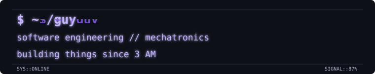

<div align="right">

<a href="README.md">🇧🇷 Português</a> | 🇺🇸 English

</div>

<br>

<div align="center">



</div>

<br>

```text
[ SYSTEM ONLINE ]  /guy  :: tty/0  :: signal 87%
> loading engineering_stack ...
> profile status: stable-ish
> operator: human // proceed with caution
```

## `$ whoami`

`[ IDENTITY ] // online // signal: clean`

João Guilherme de O. Miranda. Online, just **Guy**.

Software Engineering student and Mechatronics technician. One taught me how to program; the other taught me to distrust any solution that only exists inside a screen.

Mechatronics is why I cannot look at a software problem without wondering how it would make a real motor move.

```text
$ id
uid=GUI(guy) groups=software, mechatronics, physics
$ uptime --fast
curiosity: permanent    sleep: deprecated    signal: unstable
```

<br>

## `$ cat interests.txt`

`[ MODULES ] // loaded: 07 // interference: low`

```
Python            → automation, science, experiments escaping their original scope
C++               → embedded systems, things that need to run without excuses
ESP32 / ESP8266   → hardware responding to code (sometimes)
Arduino           → where it all started
embedded systems, electronics, automation
physics, mathematics, scientific computing
artificial intelligence
```

It started as a Physics exercise. It got a graph. Things escalated.

`[TRACE//FAST] input: curiosity  ->  output: one more experiment  ->  status: apparently working`

<br>

## `$ ls projects/`

`[ DIRECTORY ] // projects // scan: stable-ish`

`[LIVE FEED] projects/ :: scan 100% :: anomaly count: 02 :: visual noise: HIGH`

```text
drwxr-xr-x  ./projects/
├── projectile-motion-simulator  [python / physics / simulation]
└── smart-stock                  [embedded / automation / mechatronics]
```

**[projectile-motion-simulator](https://github.com/jguilhermemiranda/projectile-motion-simulator)**
A projectile motion simulator in Python, born from a Physics exercise I decided to take too far.

**[smart-stock](https://github.com/jguilhermemiranda/smart-stock)**
An automated inventory management system, the final project for my Mechatronics technical degree — embedded systems and automation applied to a real materials-control problem.

I have a dangerous habit of turning “this would be interesting to test” into a new repository. Both of the ones above survived the test of time.

<br>

## `$ tail -f learning_now.log`

`[ STREAM ] // learning_now.log // live feed`

```
[...] data structures & algorithms
[...] software architecture
[...] databases
[...] computer networks
[...] embedded systems
[...] mathematical modeling & physics simulation
[..//WARN..] progress detected; restarting focus...
```

<br>

## `$ cat education.md`

`[ RECORD ] // education // checksum: valid`

**Software Engineering** — UGB *(in progress)*
**Mechatronics Technician** — ICT *(completed)*

```text
> curriculum checksum: valid
> specialization: making software touch reality
> last known state: still learning
```

<br>

## `$ contact`

`[ LINK ] // contact ports // signal: open`

<div align="center">

<a href="https://github.com/jguilhermemiranda"></a>
<a href="https://www.linkedin.com/in/joão-guilherme-o-953561313"></a>
<a href="mailto:joaoguilhermeomiranda@gmail.com"></a>

</div>

<!-- if you are reading the raw, you probably already know this commit works and does not work until someone runs the build -->

```text
github://jguilhermemiranda   linkedin://joão-guilherme-o-953561313
status: reachable             packet loss: probably intentional
```

---

<div align="center">
<sub>Guy — software engineering, mechatronics by origin</sub>
</div>

##  Contribution Graph

`[ CONTRIBUTION MATRIX ] :: purple signal layer :: visual noise controlled`

<div align="center">


</div>
