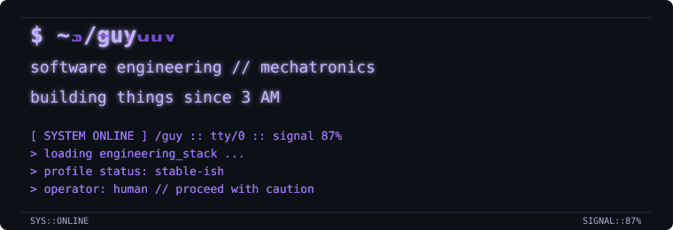
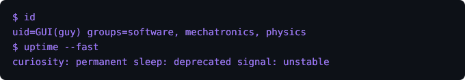
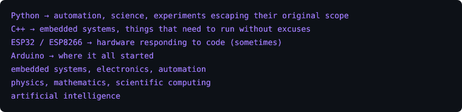
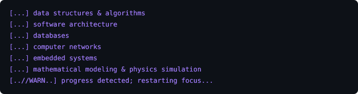
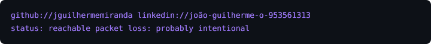

<a href="README.md">🇧🇷 Português</a> | 🇺🇸 English

 

 

## `$ whoami`

João Guilherme de O. Miranda. Online, just **Guy**.

Software Engineering student and Mechatronics technician. One taught me how to program; the other taught me to distrust any solution that only exists inside a screen.

Mechatronics is why I cannot look at a software problem without wondering how it would make a real motor move.

 

## `$ cat interests.txt`

It started as a Physics exercise. It got a graph. Things escalated.

 

## `$ ls projects/`

**[G.U.Y.](https://github.com/jguilhermemiranda/guy-I.A)**
A local AI in Python with memory, RAG, autonomous agents, and experimental neural architectures.

**[smart-stock](https://github.com/jguilhermemiranda/smart-stock)**
An automated inventory management system developed as the final project for my Mechatronics technical degree — embedded systems and automation applied to a real materials-control problem.

I have a dangerous habit of turning “this would be interesting to test” into a new repository. Both of the ones above survived the test of time.

 

## `$ tail -f learning_now.log`

 

## `$ cat education.md`

**Software Engineering** — UGB *(in progress)*
**Mechatronics Technician** — ICT *(completed)*

 

## `$ contact`

<!-- if you are reading the raw, you probably already know this commit works and does not work until someone runs the build -->

---

Guy — software engineering, mechatronics by origin

##  Contribution Graph

