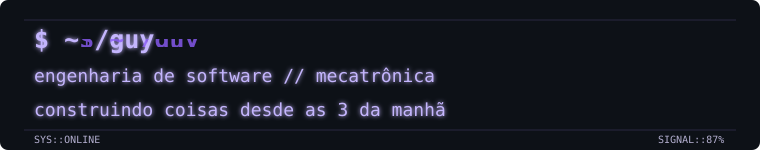

<div align="right">

🇧🇷 Português | <a href="README.en.md">🇺🇸 English</a>

</div>

<br>

<div align="center">



</div>

<br>

```text
[ SYSTEM ONLINE ]  /guy  :: tty/0  :: signal 87%
> loading engineering_stack ...
> profile status: stable-ish
> operator: human // proceed with caution
```

## `$ whoami`

`[ IDENTITY ] // online // signal: clean`

João Guilherme de O. Miranda. Online, só **Guy**.

Estudante de Engenharia de Software, técnico em Mecatrônica. Uma formação me ensinou a programar, a outra me ensinou a desconfiar de qualquer solução que só exista dentro da tela.

A Mecatrônica é a razão de eu não conseguir olhar para um problema de software sem pensar em como ele tocaria um motor de verdade.

```text
$ id
uid=GUI(guy) groups=software, mechatronics, physics
$ uptime
curiosity: permanent    sleep: deprecated
```

<br>

## `$ cat interesses.txt`

`[ MODULES ] // loaded: 07 // interference: low`

```
Python            → automação, ciência, experimentos que fogem do escopo original
C++               → sistemas embarcados, coisas que precisam rodar sem desculpa
ESP32 / ESP8266   → hardware que responde ao código (às vezes)
Arduino           → onde tudo isso começou
sistemas embarcados, eletrônica, automação
física, matemática, computação científica
inteligência artificial
```

Começou como exercício de Física. Ganhou um gráfico. As coisas escalaram.

`[TRACE] input: curiosidade  ->  output: mais um experimento  ->  status: aparentemente funcionando`

<br>

## `$ ls projetos/`

`[ DIRECTORY ] // projects // scan: stable-ish`

`[LIVE FEED] projects/ :: scan 100% :: anomaly count: 02 :: visual noise: HIGH`

```text
drwxr-xr-x  ./projetos/
├── projectile-motion-simulator  [python / physics / simulation]
└── smart-stock                  [embedded / automation / mechatronics]
```

**[projectile-motion-simulator](https://github.com/jguilhermemiranda/projectile-motion-simulator)**
Simulador de movimento de projétil, em Python, nascido de um exercício de Física que eu decidi levar longe demais.

**[smart-stock](https://github.com/jguilhermemiranda/smart-stock)**
Sistema de gestão de estoque automatizado, TCC do técnico em Mecatrônica — embarcados e automação aplicados a um problema real de controle de materiais.

Tenho o hábito perigoso de transformar "isso seria interessante de testar" em um repositório novo. Os dois acima sobreviveram ao teste do tempo.

<br>

## `$ tail -f estudando_agora.log`

`[ STREAM ] // learning_now.log // live feed`

```
[...] estruturas de dados & algoritmos
[...] arquitetura de software
[...] banco de dados
[...] redes de computadores
[...] sistemas embarcados
[...] modelagem matemática & simulação física
[..//WARN..] progresso detectado; reiniciando foco...
```

<br>

## `$ cat formacao.md`

`[ RECORD ] // education // checksum: valid`

**Engenharia de Software** — UGB *(em andamento)*
**Técnico em Mecatrônica** — ICT *(concluído)*

```text
> curriculum checksum: valid
> specialization: making software touch reality
> last known state: still learning
```

<br>

## `$ contact`

`[ LINK ] // contact ports // signal: open`

<div align="center">

<a href="https://github.com/jguilhermemiranda"></a>
<a href="https://www.linkedin.com/in/joão-guilherme-o-953561313"></a>
<a href="mailto:joaoguilhermeomiranda@gmail.com"></a>

</div>

<!-- se você está lendo o raw, provavelmente já sabe que este commit funciona e não funciona até alguém rodar o build -->

```text
github://jguilhermemiranda   linkedin://joão-guilherme-o-953561313
status: reachable             packet loss: probably intentional
```

---

<div align="center">
<sub>Guy — engenharia de software, mecatrônica de origem</sub>
</div>

##  Contribution Graph

`[ CONTRIBUTION MATRIX ] :: purple signal layer :: visual noise controlled`

<div align="center">


</div>
