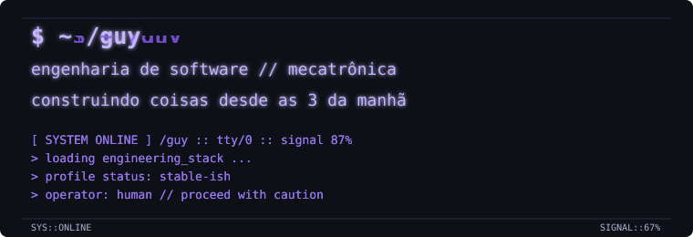
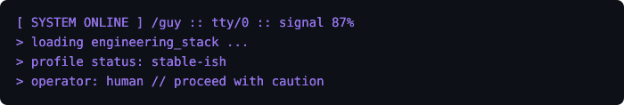
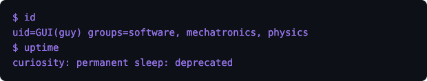
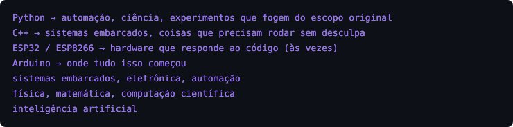
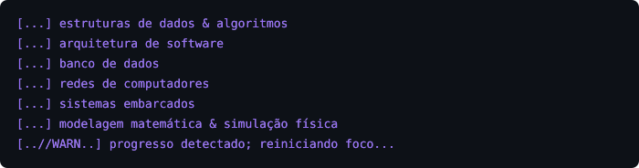

🇧🇷 Português | <a href="README.en.md">🇺🇸 English</a>

 

 

## `$ whoami`

João Guilherme de O. Miranda. Online, só **Guy**.

Estudante de Engenharia de Software, técnico em Mecatrônica. Uma formação me ensinou a programar, a outra me ensinou a desconfiar de qualquer solução que só exista dentro da tela.

A Mecatrônica é a razão de eu não conseguir olhar para um problema de software sem pensar em como ele tocaria um motor de verdade.

 

## `$ cat interesses.txt`

Começou como exercício de Física. Ganhou um gráfico. As coisas escalaram.

 

## `$ ls projetos/`

**[G.U.Y.](https://github.com/jguilhermemiranda/guy-I.A)**
Uma IA local em Python, com memória, RAG, agentes autônomos e arquiteturas neurais experimentais.

**[smart-stock](https://github.com/jguilhermemiranda/smart-stock)**
Sistema de gestão de estoque automatizado, TCC do técnico em Mecatrônica — embarcados e automação aplicados a um problema real de controle de materiais.

Tenho o hábito perigoso de transformar "isso seria interessante de testar" em um repositório novo. Os dois acima sobreviveram ao teste do tempo.

 

## `$ tail -f estudando_agora.log`

 

## `$ cat formacao.md`

**Engenharia de Software** — UGB *(em andamento)*
**Técnico em Mecatrônica** — ICT *(concluído)*

 

## `$ contact`

<!-- se você está lendo o raw, provavelmente já sabe que este commit funciona e não funciona até alguém rodar o build -->

---

Guy — engenharia de software, mecatrônica de origem

##  Contribution Graph

